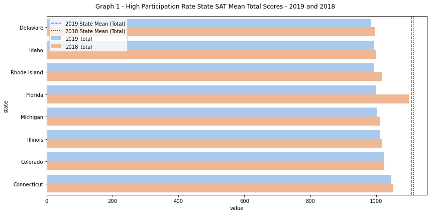

#  Project 1: Standardized Test Analysis

# SAT Analysis: Analyzing test scores from 2018 – 2019 against 2019 college SAT mean scores

__Background__ 
For our first project, we're going to take a look at aggregate SAT scores and participation rates in the United States. We'll seek to identify trends in the data and combine our data analysis with outside research to address our problem statement.

__Contents__
1.	[Problem Statement](#problem-statement)
2.	[Executive Summary](#executive-summary)
3.	[Data Sources](#data-sources)
4.	[Data Dictionary](#data-dictionary)
5.	[Python Library Used](#python-library-used)
6.	[EDA performed in Jupyter notebook](#exploratory-data-analysis-performed-in-sat_state_and_college_major_mean_analysis.ipynb)
7.	[Data Visualization](#data-visualization-applied-in-sat_state_and_college_major_mean_analysis.ipynb)
8.	[External Research](#external-research)
9.	[Conclusions and Recommendations](#conclusions-and-cecommendations)
10.	[References](#references)

## Problem Statement
You are an employee of an education Centre. Your boss is planning to open education centres in a few states to improve the college major qualification rate for that state. Your boss tasked your team to investigate and recommend some states for the expansion.

After discussion with the team, the team decided on the following:
1. To investigate the limiting factors for college admittance in states with lower SAT scores
2. Based on the 2019 SAT mean scores, identify the states that have low college major qualification rate
3. Find out how many subjects, and which subject(s), to focus on for these states

## Executive Summary
### Introduction
The SAT is standardized tests that many colleges and universities in the United States require for their admissions process. This score is used along with other materials such as grade point average (GPA) and essay responses to determine whether or not a potential student will be accepted to the university.

The SAT has two sections of the test: Evidence-Based Reading and Writing and Math ([*source*](https://www.princetonreview.com/college/sat-sections)). For information on SAT can be found on their website:
- [SAT](https://collegereadiness.collegeboard.org/sat)

_*For the below writeup, we will use EBRW to represent Evidence-Based Reading and Writing_

### Summary of analysis
We will be using the data of SAT in both 2018 and 2019 for states and college majors, as released by CollegeBoard. Data such as participation rates and tests mean scores are used for comparison and analysis. We will be calculating a comparison count where the state’s SAT mean score for each category is greater than with all college major’s SAT mean score for analysis.

External research will be performed to better understand SAT scores, the policies and requirements for education in different states. With these information, we will be making recommendation for which state to start improving on.

## Data sources
For the analysis, we will be using the following datasets: 
__Year 2019:__
- [`sat_2019.csv`](./data/sat_2019.csv): 2019 SAT Scores by State
- [`sat_2019_by_intended_college_major.csv`](./data/sat_2019_by_intended_college_major.csv): 2019 SAT Scores by Intended College Major
__Year 2018:__
- [`sat_2018.csv`](./data/sat_2018.csv): 2018 SAT Scores by State
- [`sat_2018_by_intended_college_major.csv`](../data/sat_2018_by_intended_college_major.csv): 2018 SAT Scores by Intended College Major

The following dataset is prepared by ourselves:
- `sat_2018_by_intended_college_major.csv` created from referencing the data from collegeboard ([source](https://reports.collegeboard.org/archive/sat-suite-program-results/2018/state-results))

The following dataset were created and used during the project:
- SAT_2018_2019_state_avg (combination of state SAT 2018 and 2019 data)
- SAT_College_Major_Avg_2018_2019 (combination of college major SAT 2018 and 2019 data)
- SAT_2018_2019_count_of_state_avg_higher_than_college_avg (Count of State’s SAT Score Higher than College Majors’ SAT score)

## Data Dictionary
Below is a data dictionary containing all the data features, type and its description used during the project:

|Feature|Type|Dataset|Description|
|---|---|---|---|
| state |object|df_sat_combine, df_sat_state_count_mean|States Name that has SAT results|
| 2019_participation_rate |float64|df_sat_combine|State's participation rate in 2019 (for high-school graduates)|
| 2019_ebrw |int64|df_sat_combine|State's Mean SAT Evidence-Based Reading and Writing score in 2019|
| 2019_math |int64|df_sat_combine|State's Mean SAT Math score in 2019|
| 2019_total |int64|df_sat_combine|State's Mean SAT total score in 2019|
| 2018_participation_rate |float64|df_sat_combine|State's participation rate in 2018 (for high-school graduates)|
| 2018_ebrw |int64|df_sat_combine|State's Mean SAT Evidence-Based Reading and Writing score in 2018|
| 2018_math |int64|df_sat_combine|State's Mean SAT Math score in 2018|
| 2018_total |int64|df_sat_combine|State's Mean SAT total score in 2018|
| college_major | object|df_sat_college_combine|College Major that accepts SAT score for admission in 2018 and 2019|
| 2019_test_takers |int64|df_sat_college_combine|Number of test takers that submits their SAT score for the college major in 2019|
|  2019_percentage_of_test_takers |float64|df_sat_college_combine|Percentage of test takers in 2019|
| 2019_college_total |int64|df_sat_college_combine|Mean SAT total score for test takers in 2019|
| 2019_college_ebrw |int64|df_sat_college_combine|Mean SAT Evidence-Based Reading and Writing score for test takers in 2019|
| 2019_college_math |int64|df_sat_college_combine|Mean SAT Math score for test takers in 2019|
| 2018_test_takers |int64|df_sat_college_combine|Number of test takers that submits their SAT score for the college major in 2018|
|  2018_percentage_of_test_takers |float64|df_sat_college_combine|Percentage of test takers in 2018|
| 2018_college_total |int64|df_sat_college_combine|Mean SAT total score for test takers in 2018|
| 2018_college_ebrw |int64|df_sat_college_combine|Mean SAT Evidence-Based Reading and Writing score for test takers in 2018|
| 2018_college_math |int64|df_sat_college_combine|Mean SAT Math score for test takers in 2018|
| 2019_count_total |int64|df_sat_state_count_mean|Count of State's Mean SAT total score higher than College Major Mean SAT total score in 2019|
| 2019_count_ebrw |int64|df_sat_state_count_mean|Count of State's Mean SAT Evidence-Based Reading and Writing score higher than College Major Mean SAT Evidence-Based Reading and Writing score in 2019|
| 2019_count_math |int64|df_sat_state_count_mean|Count of State's Mean SAT Math score higher than College Major Mean SAT Math score in 2019|
| 2018_count_total |int64|df_sat_state_count_mean|Count of State's Mean SAT total score higher than College Major Mean SAT total score in 2018|
| 2018_count_ebrw |int64|df_sat_state_count_mean|Count of State's Mean SAT Evidence-Based Reading and Writing score higher than College Major Mean SAT Evidence-Based Reading and Writing score in 2018|
| 2018_count_math |int64|df_sat_state_count_mean|Count of State's Mean SAT Math score higher than College Major Mean SAT Math score in 2018|

## Python Library Used
The following Python Library was used:

__For Calculations and Data Manipulations__
1. Numpy
2. Pandas
3. Stats

__For Graph Plottings__
1. Matplotlib
2. Seaborn

__For csv file exporting folder creation__
1. os

## Exploratory Data Analysis performed in sat_state_and_college_major_mean_analysis.ipynb

In this section, we came up with a function to calculate standard deviation and mean manually, not using Pandas or numpy library. We noticed that Standard Deviation calculated using this function will be the same as the `numpy` standard deviation but it will be different from the value calculated using `pandas`. Setting `ddof=1` in `numpy` standard deviation will get the same result as `pandas` function. ([source]( https://stackoverflow.com/questions/24984178/different-std-in-pandas-vs-numpy)) While it is possible to change the function to obtain the same results as `pandas` function, we decided that it is okay and we will leave the function as it is.

Before starting any analysis of the data, each individual dataset was imported to a Pandas DataFrame and data cleaning was conducted to ensure all datatypes were accurate and any other errors identified were fixed. The datasets were merged into 3 different Dataframes based on the type of data it corresponds with.
1. State’s SAT mean scores
2. College Major’s SAT mean scores
3. Count of State’s SAT mean score higher than College Majors’ SAT mean score.

Using all data from the 3 dataframes, an exploratory data analysis was performed to determine any relationships or trends that we can make meaningful conclusions on. Below are some of the analysis performed on both 2018 and 2019 data:
- Maximum and Minimum of the Count of State’s SAT mean score higher than College Majors’ SAT mean score
- Maximum and Minimum of Participation Rate / Test takers
- Maximum and Minimum of State’s SAT mean score / College Major’s SAT mean score

## Data Visualization applied in sat_state_and_college_major_mean_analysis.ipynb
In this section, plotting of different type of diagrams were used to study and visualise the trend data. Functions were built for different methods of plotting. The following lists the type of plots used in the analysis:
- Heatmap
- Scatterplot with regression line
- Histograms (with KDE line)
- Boxplot and Violinplot
- Barplot

## External Research
__SAT Max and Min score:__ 
For SAT test results([_source_](https://collegereadiness.collegeboard.org/sat/scores/understanding-scores/interpreting)), we know the following
- Total = Evidence-Based Reading and Writing + Math
- 200 <= Evidence-Based Reading and Writing <= 800
- 200 <= Math <= 800
- 400 <= Total <= 1600

__Factors for College Admissions:__[source]( https://www.collegedata.com/resources/getting-in/what-do-colleges-look-for-in-students) 
Most important factors
1.	Grades in college Prep courses
2.	Strength of curriculum (in high school)
3.	Admission Test scores such as SAT or ACT
4.	Grades in all courses
Other important factors:
1.	Extracurricular commitment
2.	Letters of recommendation
3.	Essay or writing sample
4.	Demonstrated interest
5.	Class rank
6.	Personal Qualities
Not all colleges use the same criteria when admitting students.

__States that provide Free SAT test:__([source]( https://www.collegeraptor.com/getting-in/articles/act-sat/states-act-sat-given-free/)) 
These states provide the SAT free to all juniors:
-	Michigan
-	Connecticut
-	New York
-	Delaware
-	Idaho
-	New Hampshire
-	Illinois
-	In Colorado, the SAT is only free for juniors in public schools.
-	The SAT is not required in the District of Columbia but is offered free to all juniors and seniors in the state who wish to take it.
-	In Maine, the SAT used to be mandatory for all juniors. It is now optional and offered free of charge.
-	The SAT is not required in Rhode Island, but juniors who want to take it will have the option to take it for free in school.
-	In the states of Arizona, Minnesota, Tennessee, Florida, Texas, and Maryland, a few schools or districts can administer the SAT exam to their students. This may be optional or a mandatory requirement.

## Conclusions and Recommendations
__1. To investigate the limiting factors for college admittance in states with lower SAT scores__
- SAT scores:
    1. States that had lower score in EBRW than math usually native language is not English. E.g. New Jersey has 69% population speaking English at Home. ([source](https://www.migrationpolicy.org/data/state-profiles/state/language/NJ))
    2. Accessibility to SAT tests ([source](https://www.collegeraptor.com/getting-in/articles/act-sat/states-act-sat-given-free/))
      - With high participation rate, the mean score of the country will be lower as found in our analysis.
      - States like Delaware and Idaho which provides free SAT tests are among the states that had the lowest Comparison counts for both 2019 and 2018.
           
- Other factors (but not limited to) that contributes to college admission such as: [source](https://www.collegedata.com/resources/getting-in/what-do-colleges-look-for-in-students)
    1. Grades in college Prep courses
    2. Strength of curriculum (in high school)
    3. Grades in all courses
    4. Admission Test scores such as ACT

__2. Based on the 2019 SAT mean scores, identify the states that have low college major qualification rate__

- Virgin Islands, Puerto Rico and  West Virginia have the lowest count of SAT mean scores above college major mean scores. This suggests that these states will require other factors that affect college major qualification to be higher.

- The SAT mean score for these 3 states are to lowest as well, which suggests that they might be demand for additional SAT preparation.

__3. Find out how many subjects, and which subject(s), to focus on for these states__

For our scenario, we will look at states that has high participation rates as they will be likely keener to partake in SAT preparation courses.

From Graph 1 (below), we noticed the states with high participation rates are below average for their total scores, which suggests that these states can focus on increasing both aspects of the SAT test to bring up their total scores.

For states such as Hawaii and New Jersey that has populations main language not English, we noticed that their score for EBRW is comparable to Math, but that was not the case in 2018 for Hawaii. This suggests that these states can focus on EBRW preparation to bring up their EBRW mean scores.

__The following recommendations can be put up:__
1. To open education centres on SAT preparations at states with high participation rates and focus on both EBRW and Math
2. To open education centres focusing on EBRW at states with more than 20% of population (state's) who do not speak English as their primary language such as New Jersey and Hawaii.
3. To consider opening education centres at Delaware and Idaho as this 2 states have low comparison count (of State SAT mean score against College Majors' mean score) and high participation rates for both 2019 and 2018.

__Limitations of research:__
1. We could have removed the data for Puerto Rico and Virgin islands instead of using the participation rate mean as an estimate of the state's mean. This would suggest that we will remove Puerto Rico and Virgin Islands from being in the list of lowest counts of state's SAT mean score against college majors' mean score and being the lowest in SAT mean score for Math and Total.
2. Further research can be performed for selected states such as Delaware, Idaho, where there is high participation rates for the states should this be the direction determined by the company.

## References
1. For SAT 2019 state results data cleaning 
https://reports.collegeboard.org/archive/sat-suite-program-results/2019/state-results
2.  For SAT 2018 state results data cleaning and college major information extraction 
https://reports.collegeboard.org/archive/sat-suite-program-results/2018/state-results
3. For SAT 2019 and 2018 comparison of number of people taking SAT: 
> Number of people taking SAT: 
> Class of 2018:
https://newsroom.collegeboard.org/more-2-million-students-class-2018-took-sat-highest-ever
>
> Class of 2019:
https://newsroom.collegeboard.org/over-22-million-students-class-2019-took-sat-largest-group-ever

4. For standard deviation function difference 
https://stackoverflow.com/questions/24984178/different-std-in-pandas-vs-numpy
5. SAT score interpretation 
https://collegereadiness.collegeboard.org/sat/scores/understanding-scores/interpreting

6. Points that college looks out for when accepting students:
https://www.collegedata.com/resources/getting-in/what-do-colleges-look-for-in-students

7. Accessibility to SAT and/or ACT
https://www.collegeraptor.com/getting-in/articles/act-sat/states-act-sat-given-free/
